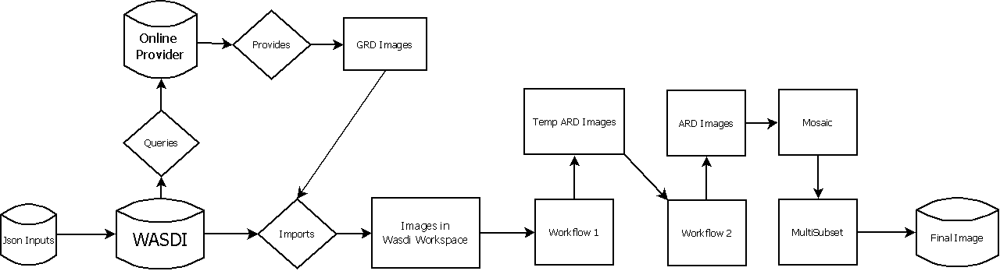
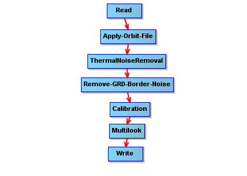
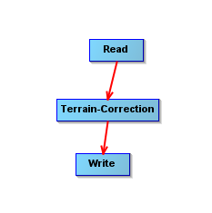
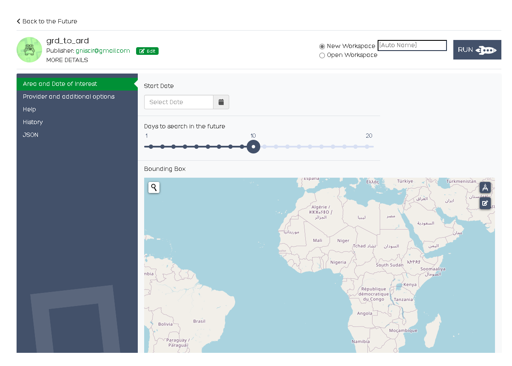

# GRD to ARD conversion algorithm 

## Design Requirement Specification Document

DIBRIS – Università di Genova. Scuola Politecnica, Corso di Ingegneria del Software 80154

**Authors**  
Roberto Gnisci 
Matteo Aicardi

### REVISION HISTORY

| Version    | Date        | Authors      | Notes        |
| ----------- | ----------- | ----------- | ----------- |
| 1.0 | 30/6/2022 |M. Aicardi, R. Gnisci | First Draft |
| 1.1 | 4/7/2022 |M. Aicardi, R. Gnisci | Second Draft |
| 1.2 | 17/8/2022 |M. Aicardi, R. Gnisci | Third Draft |
| 1.3 | 31/8/2022 |M. Aicardi, R. Gnisci | Fourth Draft |
| 1.4 | 5/10/2022 |M. Aicardi, R. Gnisci | Fifth Draft |
| 1.5 | 10/10/2022 |M. Aicardi, R. Gnisci | Sixth Draft |
| 1.6 | 31/10/2022 |M. Aicardi, R. Gnisci | Seventh Draft |
| 1.7 | 4/11/2022 |M. Aicardi, R. Gnisci | Eighth Draft |
| 1.8 | 10/10/2022 |M. Aicardi, R. Gnisci | Final Draft |

## Table of Content

1. [Introduction](#intro)
    1. [Purpose and Scope](#purpose)  
    2. [Definitions](#def)
    3. [Bibliography](#biblio)
2. [Project Description](#description)
    1. [Project Introduction](#project-intro)
    2. [Technologies used](#tech)
    3. [Assumptions and Constraints](#constraints)
3. [System Overview](#system-overview)
    1. [System Architecture](#architecture)
    2. [System Interfaces](#interfaces)
    3. [System Data](#data)
        1. [System Inputs](#inputs)
        2. [System Outputs](#outputs)

##    1 Introduction

    
###  1.1 Purpose and Scope

 
    
 The goal of this Python algorithm is to convert GRD images into ARD ones in order to build a mosaic and then a subset of the interested area  

    
 In particular the algorithm is divided in 4 steps: the first is collecting the input parameters from the designated json, the second is the search of the GRD images on WASDI, the third is to process the GRD using workflows to obtain the ARD, the last one is building the mosaic and cutting it to highlight only the desired area

###  1.2 Definitions
    
| Name				| Definition | 
| ------------------------------------- | ----------- | 
| WASDI                                 | Web Advanced Space Developer Interface |
| Workspace                             | Space on WASDI where a user can store and manipulate satellitar images|
| Workflow                              | XML file containing a series of operations applied to a image in order to process it into something else|
| SAR                                   | Synthetic Aperture Radar|
| S1                                    | Sentinel 1 Satellite |
| OST                                   | Open Sar Toolkit |
| ARD                                   | Analysis Ready Data |
| GRD                                   | Ground Range Detected |
    

###  1.3 Bibliography

 
    
 Libraries Used
    

    

       https://wasdi.readthedocs.io/en/latest/index.html (WASDI documentation)
    

    

       https://github.com/ESA-PhiLab/OpenSarToolkit (OST developers created the ARD format and the workflows that are used to convert a GRD)
    

    

        https://docs.python.org/3/library/datetime.html (datetime library used to manage dates)
    

    

        https://docs.python.org/3/library/os.html
    

    

        https://docs.python.org/3/library/pathlib.html?highlight=pathlib#module-pathlib (libraries used to manage internal paths)
    

##  2 Project Description

###  2.1 Project Introduction 

   
 Initially the algorithm reads all the inputs from the json and uses the values of BBOX, STARTDATE, SEARCHDAYS and PROVIDER to execute an image search on WASDI using their search function (for this algorithm the SAR satellite Sentinel 1 is used). Once a set of GRD images is found that overlaps the desired bounding box within the specified time interval and using the requested provider, it will be imported in a Wasdi Workspace where the conversion process begins. For each GRD image two Workflows are applied to generate an ARD image (the first one generates a temp_ard without Terrain Correction while the second applies the Terrain Correction), after every new image is ready a mosaic is created using wasdi.mosaic and then a subset is made using wasdi.multisubset.
    At last, if the user sets DELETE ARD to true, the algorithm will delete all the middle products including the ARD images from the Workspace.
    The full algorthm is present on WASDI as a processor and can be accessed by a UI to easily fill the json.
   

###  2.2 Technologies used

 
    
 Software used to develope the algorithm 

    

        https://www.jetbrains.com/pycharm/  (PyCharm IDE)
    

    

        https://step.esa.int/main/toolboxes/snap/ (SNAP S1 Toolbox, used to check the resulting images and developing the workflows)
    

    

        https://www.wasdi.net/#!/home (WASDI cloud services and libraries)
    

###  2.3 Assumption and Constraint 

 
    
 There are both assumptions and constraints
    

    
 
         
        Since this is a WASDI processor you will need an account to execute the code correctly
    

    
 
        After an account is made if you wish to execute the algorithm from a local computer you will need to follow these instructions:
         
        https://wasdi.readthedocs.io/en/latest/ProgrammingTutorials/PythonTutorial.html
    

     
 
        The algorithm assumes that all the required inputs for the json are filled correctly (using the online UI will ensure that)
    

    
    
   
  

##   3 System Overview

###   3.1 System Architecture

 
    
 Graphic of the System Architecture
    

    

        Graphical representation of the system architecture.  
       
    

        The first Workflow contains these blocks/operations (image taken from SNAP)
         
    
    

    

        The second Workflow contains these blocks/operations (image taken from SNAP)
         
    
    

        

###   3.2 System Interfaces

 
    
 Put a summary of the section
    

    
The System has two types of interfaces: online and offline.  
       Both of them require that a json parameter file is created with the following parameters:
        
       <ul>
            <li>BBOX: A json structure divided into "northEast" and "southWest", in each subfield is specified both a latitude and a longitude. This defines                       the desired area
            <li>STARTDATE: The starting date of the time interval of the search in the format "yyyy-mm-dd"
            <li>SEARCHDAYS: For how many days does the time interval extends
            <li>PROVIDER: Which sateliitar images provider you wish to use (Must be supported by WASDI), is suggested to keep it as "AUTO"
            <li>DELETE ARD: true/false value that decides if the algorithm will delete all the middle products
       </ul>
        
       The Online UI will look like this and it will aid with correctly filling the json 
       
        
       
    

##   3.3 System Data

####   3.3.1 System Inputs

    
 Input Details
    

    

        The system takes in input a json parameters file as described in the former section and a config json file required to work with WASDI
    

####   3.3.2 System Ouputs

 
    
 Output Details
    

    
The final output of the algorithm is a GEOTIFF image representing the subset of the desired area applied to a mosaic made of ARD images.
         
        This image will be stored in the selected WASDI Workspace together with the original GRD images and all the midlle products if not deleted.
    

