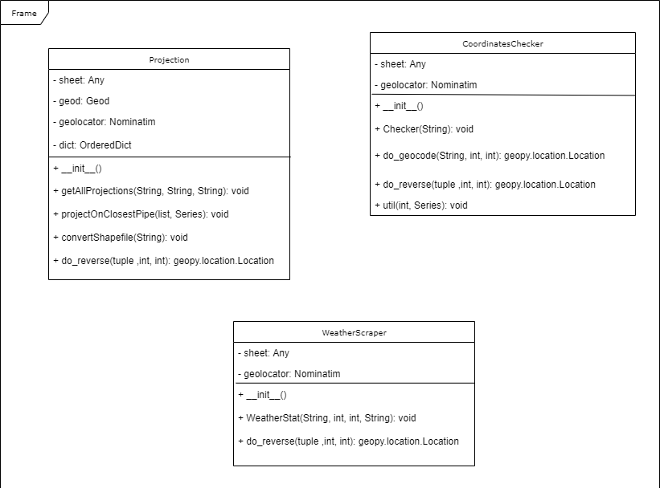

# Data manipulation Classes

## Design Requirement Specification Document

DIBRIS – Università di Genova. Scuola Politecnica, Corso di Ingegneria del Software 80154

**Authors**  
Roberto Gnisci 
Matteo Aicardi

### REVISION HISTORY

  CoordinateChecker History
   

| Version    | Date        | Authors      | Notes        |
| ----------- | ----------- | ----------- | ----------- |
| 1.0 | 18/9/2022 |M. Aicardi, R. Gnisci | First CoordinateChecker update|
| 1.1 | 28/9/2022 |M. Aicardi, R. Gnisci | Second CoordinateChecker update |
| 1.2 | 7/10/2022 |M. Aicardi, R. Gnisci | Third CoordinateChecker update |
| 1.3 | 10/10/2022 |M. Aicardi, R. Gnisci | Fourth CoordinateChecker update |
| 1.4 | 25/10/2022 |M. Aicardi, R. Gnisci | Fifth CoordinateChecker update |
| 1.5 | 5/11/2022 |M. Aicardi, R. Gnisci | Sixth CoordinateChecker update |
| 1.6 | 9/11/2022 |M. Aicardi, R. Gnisci | Final CoordinateChecker update |

   
  WeatherScraper History
   

| Version    | Date        | Authors      | Notes        |
| ----------- | ----------- | ----------- | ----------- |
| 1.0 | 17/8/2022 |M. Aicardi, R. Gnisci | First WeatherScraper update |
| 1.1 | 25/8/2022 |M. Aicardi, R. Gnisci | Second WeatherScraper update |
| 1.2 | 31/8/2022 |M. Aicardi, R. Gnisci | Third WeatherScraper update |
| 1.3 | 10/9/2022 |M. Aicardi, R. Gnisci | Fourth WeatherScraper update |
| 1.4 | 20/9/2022 |M. Aicardi, R. Gnisci | Fifth WeatherScraper update |
| 1.5 | 10/10/2022 |M. Aicardi, R. Gnisci | Sixth WeatherScraper update |
| 1.5 | 18/10/2022 |M. Aicardi, R. Gnisci | Seventh WeatherScraper update |
| 1.5 | 25/10/2022 |M. Aicardi, R. Gnisci | Eight WeatherScraper update |
| 1.5 | 6/11/2022 |M. Aicardi, R. Gnisci | Ninth WeatherScraper update |
| 1.5 | 9/11/2022 |M. Aicardi, R. Gnisci | Final WeatherScraper update |

   
  ShapeFileProjection History
   

| Version    | Date        | Authors      | Notes        |
| ----------- | ----------- | ----------- | ----------- |
| 1.0 | 10/10/2022 |M. Aicardi, R. Gnisci | First ShapeFileProjection update |
| 1.1 | 12/10/2022 |M. Aicardi, R. Gnisci | Second ShapeFileProjection update |
| 1.2 | 14/10/2022 |M. Aicardi, R. Gnisci | Third ShapeFileProjection update |
| 1.3 | 18/10/2022 |M. Aicardi, R. Gnisci | Fourth ShapeFileProjection update |
| 1.4 | 20/10/2022 |M. Aicardi, R. Gnisci | Fifth ShapeFileProjection update |
| 1.5 | 25/10/2022 |M. Aicardi, R. Gnisci | Sixth ShapeFileProjection update |
| 1.6 | 3/11/2022 |M. Aicardi, R. Gnisci | Seventh ShapeFileProjection update |
| 1.7 | 7/11/2022 |M. Aicardi, R. Gnisci | Eighth ShapeFileProjection update |
| 1.8 | 14/11/2022 |M. Aicardi, R. Gnisci | Final ShapeFileProjection update |

## Table of Content

1. [Introduction](#intro)
    1. [Purpose and Scope](#purpose)  
    2. [Definitions](#def)
    3. [Bibliography](#biblio)
2. [Project Description](#description)
    1. [Project Introduction](#project-intro)
    2. [Technologies used](#tech)
    3. [Assumptions and Constraints](#constraints)
3. [System Overview](#system-overview)
    1. [System Architecture](#architecture)
    2. [System Interfaces](#interfaces)
    3. [System Data](#data)
        1. [System Inputs](#inputs)
        2. [System Outputs](#outputs)
4. [System Module 1](#sys-module-1)
    1. [Structural Diagrams](#sd)
        1. [Class Diagram](#cd)
            1. [Class Description](#cd-description)
        2. [Dynamic Models](#dm)

##    1 Introduction

    
###  1.1 Purpose and Scope

 
    
 These classes are used to correct, filter and improve an already existing excel database 

    

      This is needed to supply a good enough dataset to train a Machine Learning model that aims to recognize if a water leak has happened near a pipe network
      analyzing satellitar images of the area.
       
      Each class serves a precise purpose:
    

    

      CoordinateChecker corrects errors in the coordinates inside the database (while also correcting the latitude and longitude)
    

    

      WeatherScraper fetches weather data and creates a "new" database containing these informations, making filtering good cases from bad cases
      (a bad case would be if it rained when a leak was detected) easier
   

   

      ShapefileProjection aims to improve the coordinates given in the database by projecting them directly onto the pipe network
      (useful for example in case of multiple nearby pipes)
   

  
    

###  1.2 Definitions
    
| Name				| Definition | 
| ------------------------------------- | ----------- | 
| NOMINATIM API                                  | Interface used to check and eventually fetch the coordinates|
| METEOSTAT API                                  | Interface used to collect weather data|
| EPSG 32632                                     | Coordinate reference system used in the original pipe network file |
| WGS84/EPSG 4326                                | Coordinate reference system needed to use the projection algorithm|
| WASDI                                          | Web Advanced Space Developer Interface |
    

###  1.3 Bibliography

 
    
 Libraries and references Used
    

    

      https://pandas.pydata.org/ (Pandas to read and write Excel files)
    

    

      https://geopy.readthedocs.io/en/stable/ (Geopy NOMINATIM API, used to do the geocoding operations)
	  

    

	    https://dev.meteostat.net/python/#installation (METEOSTAT library webpage, used to fetch weather data)
	  

    

	    https://pyproj4.github.io/pyproj/stable/ (pyproj, used to change the coordinate reference system of the shapefiles )
	  

    

	    https://shapely.readthedocs.io/en/maint-1.8/ (shapely library,  execute the projection operations on a shapefile)
	  

    

        https://docs.python.org/3/library/os.html
    

    

        https://docs.python.org/3/library/pathlib.html?highlight=pathlib#module-pathlib (os and Path libraries have been used to manage internal paths)
    

    

        https://docs.python.org/3/library/datetime.html (datetime library used to manage dates)
    

    

      https://docs.python.org/3/library/math.html (math library, basically used only to check for NaN)
    

    

      https://docs.python.org/3/library/json.html?highlight=json#module-json (json library, used to load input parameters from a json file)
    

    

      https://pypi.org/project/Fiona/ (Fiona library, used to open and write on a shapefile)
    

      
    

##  2 Project Description

###  2.1 Project Introduction 
<ul>
	<li>CoordinateChecker:
		

			ckecks in the leaks database excel file if the pairs of coordinates are correct and, if a pair is outstandingly wrong than an
			approximation is computed and substituted.
		

	<li>WeatherScraper: 
		

			reads from an Excel leaks database where and when a leak occured, then fetches precipitation data of a given period of time for that
			place. The class also approximately recognizes if apair of coordinates reside in a city, a town or a village
		

	<li>ShapeFileProjection: 
		

			reads from the leaks Excel database where a network intervention occured and then projects the obtained coordinates on the pipe
			network.The algorithm inside the class needs a specific coordinate reference system and is able to change the one used in the pipe
			network file to meet this constraint.
		

</ul>

###  2.2 Technologies used

 
    
 Software used to develope the algorithm 

    

        https://www.jetbrains.com/pycharm/  (PyCharm IDE)
    

    

      https://www.microsoft.com/it-it/microsoft-365/excel (Microsoft Excel since the database is given as an Excel file)
    

    

	    https://mapshaper.org/ (mapshaper website to visualize shapefiles)
    

###  2.3 Assumption and Constraint 

 
    
 There are both assumptions and constraints
    

    

       
      Each class was created assuming that a specificly formatted Excel file would be given as input, thus they will not work with differently formatted files
    

    

      No strict time constraints were given for the algorithms, as such some functions may take a while if the Excel file has a lot of rows
    

    

      The user must be able to connect to Internet
    

    

      For the correction algorithm the only row values that may be incorrect are the ones regarding the latitude/longitude and the date on which the repairings were finished
    

    

      For the correction algorithm if in a row the coordinates are not correct and the address contains only the city, the algorithm will assume that the city is in Italy
    

    
  

##   3 System Overview

###   3.1 System Architecture

 
    
 Diagram of how the system architecture composed by the three classes
    

     

###   3.2 System Interfaces

These classes do not have a real UI and are mostly executed via terminal.
 
 
Each class, if launched as a standalone program, supports typing manually the inputs instead of creating a json file

##   3.3 System Data

###   3.3.1 System Inputs

 
    
 Details of the inputs for each class
    

    

	 
	CoordinateChecker:
	    <ul>
		    <li>The location of the Excel database
	</ul>
    

    

	WeatherScraper (each parameter can also be specified in a json file):
	<ul>
		<li>The location of the Excel database     (EXCELLOC)
		<li>The number of days before the repair date on which you want to fecth weather data    (DAYSBEFORE)
		<li>The number of days after the repair date on which you want to fecth weather data    (DAYSAFTER)
		<li>The district of which it is desired to obtain weather data    (DISTRICT)
	</ul>
    

    

	ShapeFileProjection (each parameter can also be specified in a json file):
	<ul>
		<li>The location of the Excel database     (EXCELLOC)
		<li>The location of the Shapefile    (SHAPELOC)
		<li>The district of which it is desired to obtain projected coordinates for each row     (DISTRICT)
	</ul>
   

###   3.3.2 System Ouputs

 
    
 Details of the output for each class
    

     

	 
	CoordinateChecker:
	    <ul>
	            A new Excel file with the same columns as the original
            </ul>
     

     

	WeatherScraper:
	<ul>
		

		A new Excel file with the following columns (format of column_name:: explanation)
		

		<li>Comune::  Same as in the original Excel   
		<li>Data Inizio Esito::  Same as in the original Excel
		<li>COORD_X SNAPSHOT GIS (LAT)::  Same as in the original Excel
		<li>COORD_Y SNAPSHOT GIS (LNG)::  Same as in the original Excel
		<li>Precipitations (in mm), from <DAYSBEFORE> days before (in ascending order of date):: Real number array containing weather data in the days before the repair (including that day), can contain nan values
		<li>Precipitations (in mm), until <DAYSAFTER> days after (in ascending order of date)::  Real number array weather data in the days after the repair (including that day), can contain nan values
		<li>Mean precipitation value in the <DAYSBEFORE> days before the repair date (in mm):: Mean value calculated without considering nan values, can be nan if all the values in the precipitation cell are nan
		<li>Mean precipitation value in the <DAYSAFTER> days after the repair date (in mm):: Mean value calculated without considering nan values, can be nan if all the values in the precipitation cell are nan
		<li>Type of location:: A string that may be "city","town" or "village" depending to which the location belongs
		<li>Name of location:: A string containing the name of the location (may be different from the district)
		<li>Did it rain before the repair date ?:: Boolean value indicating if it has rained before the repair, can be nan if all the values in the precipitation cell are nan
		<li>Did it rain after the repair date ?:: Boolean value indicating if it has rained after the repair, can be nan if all the values in the precipitation cell are nan
	</ul>
    

    

	ShapeFileProjection:
	<ul>
		

		Shapefile conversion:
		

		<li>Changes the origial shapefile coordinate reference system without creating a new file
	</ul>
			 
	<ul>
		

			Shapefile projection:
		

		

		        Creates a new Excel file with the following columns (format of column_name:: explanation)
		

		<li>Intervento:: Same as in the original Excel
		<li>Comune:: Same as in the original Excel	
		<li>Indirizzo:: Same as in the original Excel
		<li>Civico:: Same as in the original Excel
		<li>Note Esecutore:: Same as the original
		<li>Data Inizio Esito:: Same as in the original Excel
		<li>Data fine:: Same as in the original Excel
		<li>ID SNAPSHOT:: Same as in the original Excel
		<li>COORD_X SNAPSHOT GIS (LAT):: Latitude of the projected point on the shapefile (closest point on the same address)
		<li>COORD_Y SNAPSHOT GIS (LNG):: Longitude of the projected point on the shapefile (closest point on the same address)
		<li>COORDINATE RISULTANTI:: Same as in the original Excel
	</ul>			
    

##   4 System Module 1

 
    
 CoordinateChecker summary
    

    
This class is used to fix all the possible error inside the excel Coordinate file in input, such as LNG and LAT columns inverted 
    and inconsistent coordinate values respect them street name 

    
 WeatherScraper summary
    

    
 This class fetch data about precipitations in a set of given places and dates. Taking into account the chosen place and the date ranges
 	it fecthes the precipitation data for every day between (reparation date-daysBefore) and (reparation date+daysAfter). 
	Additional information are added such as the mean value for the past and future days, a boolean variable that tells whether it has rained or not before or 	   after the reparation date, and the type of place (city,town,village). A new excel file will be created with all the relevant columns
   

    
 ShapefileProjection summary
    

    
 This class calculates all the projections on the main pipes of the works performed, it also has a functionality 
    to fix problems inside the shapefile in input such as different coordinate reference system (converted into epsg-4326) and wrong
    addresses with respect to coordinates.
   

###   4.1 Structural Diagrams

####   4.1.1 Class diagram

 
    
 Class diagram for all the classes 
    

    

#####   4.1.1.1 Class Description

 
    
 CoordinateChecker Class description
    

    
Attributes:

	<ul>
		<li> sheet : excel file in input.
		<li> geolocator : object instance from the geopy library, used to convert the coordinate into address and viceversa.
	</ul>
    
Methods:

	<ul>
		<li> Checker : main method of the class, it checks if the coordinates in the excel files are correct and if they are not,
        		      corrects them. A new file NewGeolocation.xlsx will be created in the project folder.
		<li> util :  method used to correct the coordinates by using the do_geocode method and then substituting the newly obtained
        		    coordinates in the i-th row.
		<li> do_geocode : given an address this method will return the respective coordinate (refering to the WGS84 coordinate system),
			  	  recursive method that will try to get the result in a max of "max_attempts" retry.
		<li> do_reverse : given a coordinate (refering to the WGS84 coordinate system) this method will return the respective address,
			  	  recursive method that will try to get the result in a max of "max_attempts" retry.
	</ul>
			

 
    
 WeatherScraper Class description
    

    
Attributes:

	<ul>
		<li> sheet : excel file in input.
		<li> geolocator : object instance from the geopy library, used to convert the coordinate into address and viceversa.
	</ul>
    
Methods:

	<ul>
		<li> WeatherStat : main method of the class, it calculates values and mean values of precipitations, if there were or not any precipitations and the 					location type, given a range date and a specific district present on the excel file in input.
		<li> do_reverse : given a coordinate (refering to the WGS84 coordinate system) this method will return the respective address,
			  	  recursive method that will try to get the result in a max of "max_attempts" retry.
	</ul>
			

 
    
 ShapeFileProjection Class description
    

    
Attributes:

	<ul>
		<li> sheet : excel file in input.
		<li> geod:  object instance from the pyproj library, used to calculate distance between line and point.
		<li> geolocator : object instance from the geopy library, used to convert the coordinate into address and viceversa.
		<li> dict: dictionary used to contains all the new projected coordinates calculated from the shapefile and the excel file.
	</ul>
    
Methods:

	<ul>
		<li> getAllProjections : create a new Excel file with all the columns inside NewGeolocation plus two more 
		                         containing the coordinates of the projected points.
		<li> projectOnClosestPipe :  method used to calculate the nearest point to the working point belonging to the main line. 
		<li> convertShapefile :  convert and substitute the coordinates in the selected shapefile from EPSG 32632 to WGS84.
		<li> do_reverse : given a coordinate (refering to the WGS84 coordinate system) this method will return the respective address,
			  	  recursive method that will try to get the result in a max of "max_attempts" retry.
	</ul>
			

####   4.2 Dynamic Models

 
    
 CoordinateChecker Dynamic Model
    

    

 
    
 WeatherScraper Dynamic Model
    

    

 
    
 ShapefileProjection Dynamic Model
    

    

